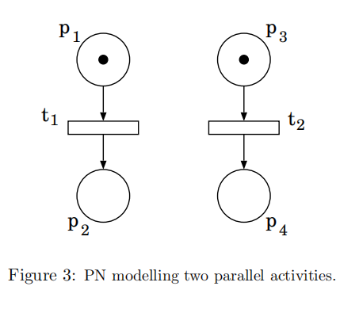
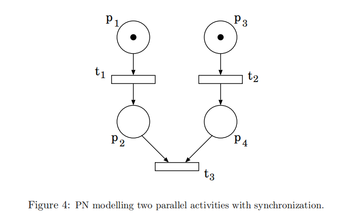
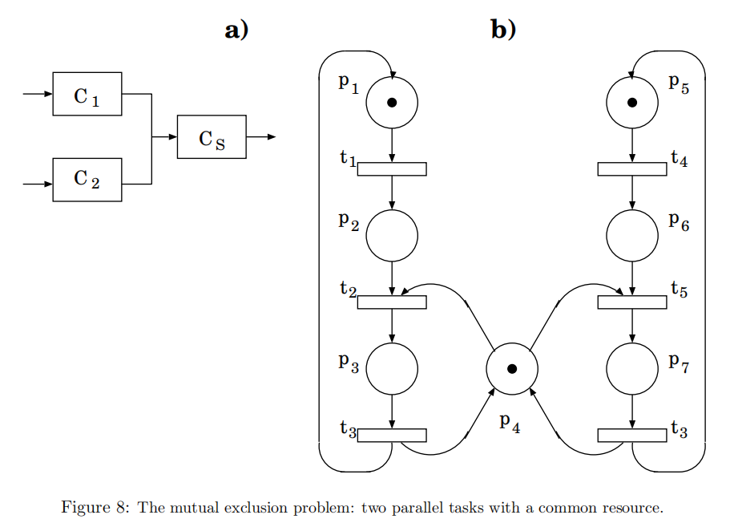
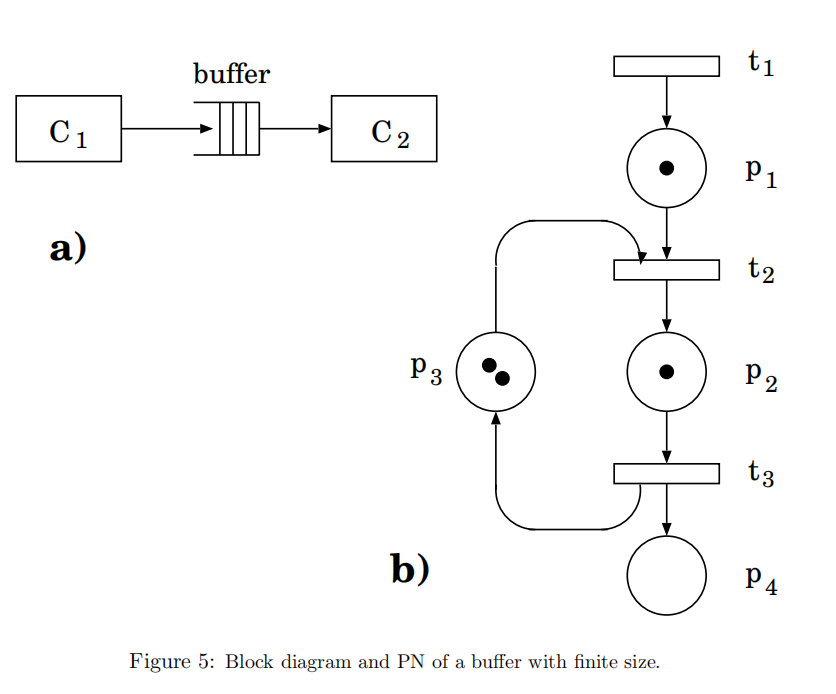
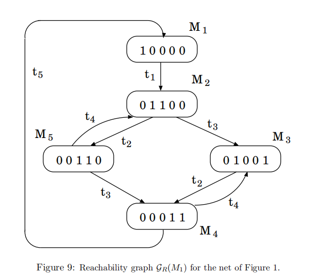
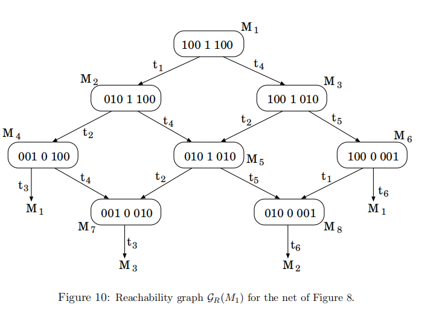

### Petri网基础知识总结

#### 1. **Petri网的基本概念**
- **定义**：Petri网是一种用于描述分布式系统中并发、同步、冲突等逻辑交互的图形化建模工具。
- **组成元素**：Petri网由五元组 (P,T,I,O,M) 定义：
  - **库所（Places）** P：表示系统状态（如资源、条件），图形化为圆圈。
  - **变迁（Transitions）** T：表示事件或活动，图形化为矩形或横线。
  - **输入函数（Input）** I：从库所到变迁的弧（连接库所和变迁，表示条件与事件之间的关系。），表示事件触发的前提条件。
  - **输出函数（Output）** O：从变迁到库所的弧，表示事件触发的后果。
  - **标识（Marking）** M：库所中的令牌（Token）（用黑点表示，代表资源的数量或条件的满足程度）分布，表示当前系统状态。

#### 2. **Petri网的动态行为**
- **使能规则**：变迁的所有输入库所中都有足够的令牌时，变迁被使能。
- **触发规则**：被使能的变迁可以触发，从输入库所移除令牌，并向输出库所添加令牌。
- **可达性**：从初始标记出发，通过一系列变迁触发，可以到达的所有标记集合称为可达集。

#### 3. **Petri网的建模能力**
- **并发（Concurrency）**：多个变迁可以同时被使能，独立触发。

- **同步（Synchronization）**：多个变迁需要同时满足条件才能触发。

  

- **互斥（Mutual Exclusion）**：资源竞争导致某些变迁不能同时触发。

- **有限资源（Limited Resources）**：通过令牌数量限制资源的可用性。

#### 4. **Petri网的性质**
- **活性（Liveness）**：变迁在任何可达标记中都有被触发的可能性。
- **安全性（Safeness）**：库所的令牌数量不超过某个上限（通常为1）。
- **有界性（Boundedness）**：库所的令牌数量有上限。
- **保守性（Conservation）**：系统中令牌的总数保持不变。

#### 5. **分析方法**
- **可达图（Reachability Graph）**：枚举所有可能状态及变迁路径，通过生成所有可达标记及其之间的变迁关系，分析系统的行为。

- **矩阵分析（Matrix Analysis）**：使用输入矩阵、输出矩阵和关联矩阵，通过线性代数方法分析可达性和不变性。

#### 6. **扩展Petri网**
- **时间Petri网（Timed Petri Nets）**：为变迁引入时间延迟，可以是确定性的或随机的。
- **随机Petri网（Stochastic Petri Nets, SPN）**：变迁的触发时间服从指数分布，系统行为可以映射为马尔可夫链。
- **高级Petri网（High-Level Petri Nets）**：通过颜色或谓词区分令牌，增强建模能力。

---

### 如何应用Petri网对系统进行建模

#### 1. **明确系统需求**
   - 确定系统中需要建模的组件、活动和交互。
   - 识别并发、同步、资源竞争等关键行为。

#### 2. **构建Petri网模型**
   - **步骤**：
     1. 定义库所：表示系统的状态或条件（如“设备空闲”、“任务排队”）。
     2. 定义变迁：表示事件或活动（如“任务开始”、“设备故障”）。
     3. 添加弧：连接库所和变迁，描述条件与事件的关系。
     4. 分配初始标记：设置初始状态下的令牌分布。
   - **示例**：
     - 生产者-消费者问题：用库所表示缓冲区状态，变迁表示生产和消费行为。
     - 互斥问题：用库所表示资源占用状态，变迁表示资源的请求和释放。

#### 3. **分析模型**
   - **可达性分析**：生成可达图，验证系统是否能到达期望或非期望状态。
   - **性能分析**：引入时间参数（如变迁的触发速率），计算系统的吞吐量、响应时间等。
   - **可靠性分析**：通过SPN映射为马尔可夫链，计算系统故障概率或平均无故障时间。

#### 4. **验证与优化**
   - 检查模型是否满足安全性、活性等性质。
   - 通过仿真或数学方法验证模型的正确性。
   - 根据分析结果优化系统设计（如调整资源数量或调度策略）。

#### 5. **工具支持**
   - 使用Petri网建模工具（如CPN Tools、PIPE）辅助构建和分析模型。
   - 对于复杂系统，可结合高级Petri网（如着色Petri网）简化模型。
