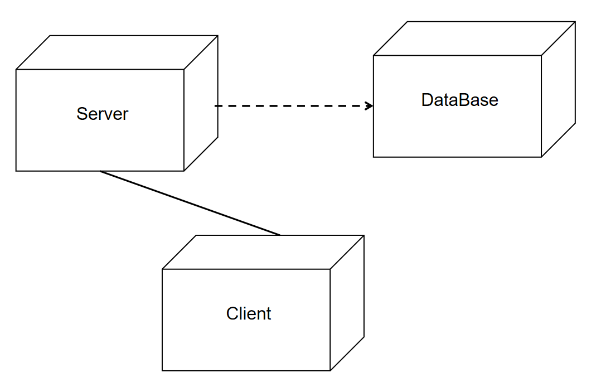
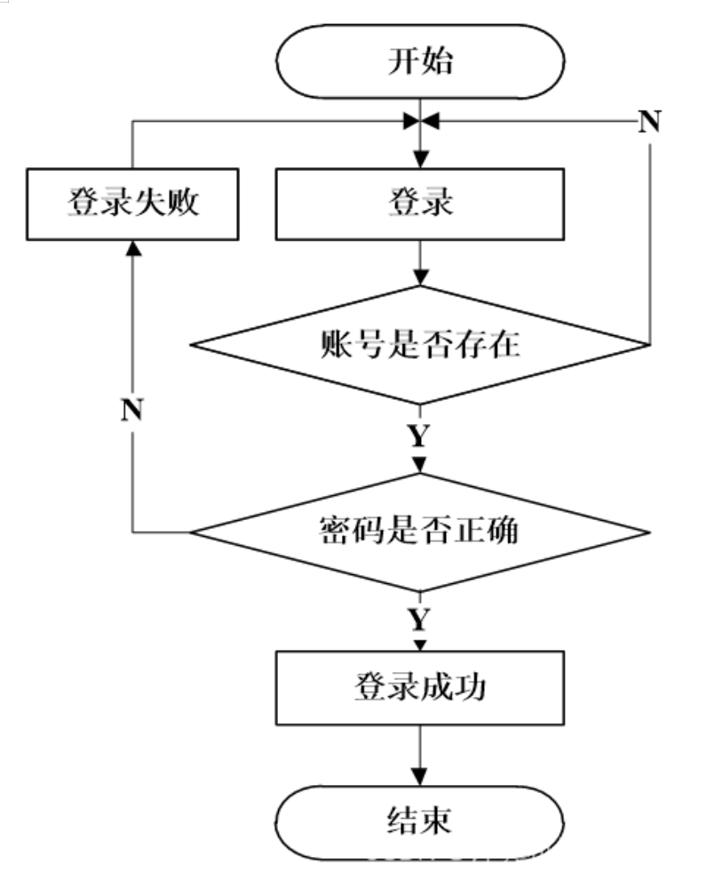

<!--contributed by gyx -->
# 1. 引言

## 1.1 目的  
本文档描述虚拟校园卡管理系统的轻量级架构设计，聚焦于用户信息管理的核心功能。通过定义系统结构、组件交互及数据库设计，为课程项目的开发与测试提供技术依据，不涉及实体卡、支付或第三方集成功能。  

## 1.2 范围  
本文档覆盖以下简化模块：  
- **用户管理模块**：虚拟账户的增删改查、权限分配（如学生/管理员角色）  
- **信息维护模块**：手动修改用户基础信息（姓名、学号、虚拟卡状态等）  
- **数据库设计**：仅需存储用户信息与操作日志，无需消费/门禁等实体功能数据表  

## 1.3 定义与缩略语  
- **虚拟校园卡**：系统中模拟的电子账户，无实体卡对应。  
- **校园卡管理系统**：指本系统，用于校园内的一卡通管理。  
- **CSCI**：计算机软件配置项（Computer Software Configuration Item）。  
- **UML**：统一建模语言（Unified Modeling Language）。  
- **SQLite**：候选轻量级数据库，支持基础CRUD操作  

## 1.4 引用文件  
- IEEE 42010:2011 - 架构描述推荐实践  
- GB/T 8567-2006 计算机软件文档编制规范  
- 项目需求规格说明书（SRS）  

<!--contributed by lzx -->
# 2.架构描述标识和概述

## 2.1 系统标识

- **正式名称**：校园卡管理系统（Campus Card Management System, CCMS）
- **版本标识**：v1.0.0  
- **开发基线**：基于SRS文档SOFT_PROJ-2025-CCMS-001_v1.0.0  
- **技术栈**：
  - 前端：Qt 5.15+ Widgets（C++）
  - 后端：C++17标准
  - 数据库：SQLite 3.35+
- **部署环境**：
  - 操作系统：Windows 10+
  - 硬件要求：x86架构/8GB RAM/500MB存储

## 2.2 架构概述

系统采用**分层架构**（Layered Architecture），基于**模型-视图-控制器（MVC）**架构风格，支持单机部署和本地网络访问。具体分层如下：

1. **前端展示层（Presentation Layer）**：
   - 使用Qt Widgets实现GUI界面
   - 包含用户登录、信息展示、管理控制台等模块
   - 响应时间≤1秒

2. **业务逻辑层（Business Logic Layer）**：
   - 使用C++实现业务处理模块
   - 包含用户管理、权限控制、交易处理等核心功能
   - 采用SHA-256加密

3. **数据访问层（Data Access Layer）**：
   - 使用SQLite C/C++ Interface进行封装
   - 实现ACID事务处理
   - 单条查询≤100ms

4. **数据存储层（Data Storage）**：
   - 用SQLite数据库文件存储数据
   - 最大容量10MB
   - 用WAL日志模式保障故障恢复

**关键架构决策**：
- 采用单机部署模式，放弃分布式架构
- 选择SQLite而非MySQL等服务器数据库
- 使用Qt信号槽机制实现松耦合

# 3. 利益相关者和关注点

## 3.1 利益相关者

1. **学校管理层**：
   - 角色：系统所有者
   - 参与度：需求定义、验收评审
   - 典型代表：信息化办公室主任

2. **教职工用户**：
   - 角色：终端用户
   - 使用场景：日常消费记录查询、门禁使用
   - 数量：约200人

3. **学生用户**：
   - 角色：主要使用者
   - 使用频率：每日多次
   - 特殊需求：自助密码修改

4. **IT运维人员**：
   - 角色：系统维护者
   - 技能要求：SQLite基础命令
   - 关键操作：数据库备份/恢复

5. **第三方支付平台**：
   - 当前状态：模拟接口
   - 未来集成：微信/支付宝API对接

## 3.2 关注点

1. **系统可用性**：
   - 量化指标：99.9%操作成功率
   - 保障措施：SQLite事务回滚机制

2. **数据安全性**：
   - 加密要求：SHA-256密码哈希
   - 访问控制：RBAC基础实现

3. **用户体验**：
   - 性能基准：界面响应≤1秒
   - 适配要求：支持1024x768+分辨率

4. **系统可扩展性**：
   - 设计预留：数据库扩展字段
   - 当前限制：单表≤500条记录

5. **维护成本**：
   - 技术债务：未实现ETL工具
   - 培训需求：管理员需3小时培训

**冲突权衡**：
- 安全性与易用性：密码复杂度要求可能增加用户操作难度
- 性能与可靠性：WAL日志模式会增加约10%写入开销
- 功能范围与开发周期：放弃第三方支付集成以保障2个月交付
<!--contributed by lzx -->

<!--contributed by zhr -->
# 4. 架构视图

## 4.1 逻辑视图（类图）

- 展示系统的核心类及其关系，如用户类、卡片类、交易类等。
- 使用UML类图表示。

## 4.2 进程视图（序列图/活动图）

- 描述系统的主要业务流程，如卡片发放流程、消费流程、门禁控制流程等。
- 使用UML序列图或活动图表示。

## 4.3 部署视图（部署图）

- 描述系统的物理部署结构，包括服务器、数据库、网络设备等。
- 使用UML部署图表示。

## 4.4 数据视图（ER图/关系模型）

- 展示系统的数据库设计，包括实体关系（ER）图和关系模型。
- 描述主要数据表及其关系，如用户表、卡片表、交易记录表等。

<!--contributed by zhr -->

<!--contributed by cy -->
# 5. 架构模型

## 5.1 核心组件

- **前端展示层**：
  - mainWindow：登录界面
  - usrWindow：学生用户界面
  - Manager：管理员界面

- **后端服务层**：
  - DatabaseManager：封装所有业务逻辑和数据访问
  - 事务管理：确保数据一致性
  - 安全验证：处理用户认证
- **数据访问层**：
  - SQLite数据库驱动
  - 数据库连接管理
  - SQL语句执行
- **数据存储层**：
  - SQLite数据库文件
  - 数据表：users, balance_change, administrators

## 5.2 关键接口

- **用户认证接口**：提供用户登录、注册、密码重置、角色识别等功能。
- **卡片管理接口**：提供用户注册、用户注销、用户信息查询等功能。
- **消费管理接口**：处理消费交易，记录交易信息，如余额查询、交易记录查询等。
- **权限管理接口**：普通用户信息查询(getUserInfoAsUser)、管理员信息查询(getUserInfoAsAdmin)、密码修改(ChangePassword)

# 6. 架构关系

## 6.1 组件间关系

- **前端与后端的关系**
  - 前端组件通过直接调用DatabaseManager方法进行交互
  - 采用Qt信号槽机制进行异步通信
  - 所有数据库操作都通过DatabaseManager单例进行

- **服务层与数据层关系**
  - DatabaseManager使用QSqlDatabase连接SQLite
  - 采用事务确保关键操作(如余额更新)的原子性
  - 通过外键约束保证数据完整性
- **组件耦合关系**：
  - 前端与后端通过接口松耦合
  - 数据库操作集中封装，便于维护
  - 业务逻辑与界面展示分离

## 6.2 与外部系统关系

- **与学校信息系统集成**：
  - 预留数据导入接口，可从学籍系统同步学生信息
  - 支持导出消费数据到财务系统
- **安全考虑**：
  - 密码采用单向加密存储
  - 敏感操作需要身份验证
  - 数据库文件进行加密保护
- **扩展性设计**：
  - 模块化设计便于添加新功能
  - 数据库结构支持未来扩展
  - 接口设计考虑多平台兼容
<!--contributed by cy -->

<!--contributed by wjq -->
# 7. 架构决策

## 7.1 技术选型决策

- B/S架构：采用浏览器/服务器模式，支持PC浏览器、移动端和自助终端多平台访问，降低客户端维护成本，提升用户体验。
- 微服务架构：基于Spring Cloud实现服务拆分，将系统划分为用户服务、支付服务、门禁服务等独立模块，提高系统的可扩展性和可维护性。
- MySQL数据库：选用关系型数据库MySQL 8.0作为核心数据存储，通过ACID事务机制保障交易数据的一致性和完整性。
 
## 7.2 安全决策

- 实施用户认证和授权机制，确保系统安全:采用账号+密码作为基础凭证，密码经SHA-256加盐哈希处理（盐值长度16字节）后存储于SQLite用户表。
- 密码策略强制要求：最小长度8位，包含字母/数字/特殊字符，90天强制更换周期,输入密码格式不对会通过mainwindow.ui实现的关于<messagebox>的部分来显示警告。
- 对敏感数据进行加密存储和传输，防止数据泄露:数据库文件采用SQLite加密扩展（SEE），防止物理设备丢失导致数据泄露。

## 7.3 性能决策

- 采用缓存技术，提高系统响应速度:支持将高频用户信息（最近访问的20个用户完整档案）,静态数据（院系列表、商户目录等）,权限规则（角色-操作映射表）存放在缓存中。
- 实施负载均衡，确保系统在高并发情况下的稳定性。

# 8. 架构原理

## 8.1 设计原则
- 单一职责原则：每个微服务仅负责单一业务域（如支付服务专注交易处理，门禁服务独立管理通行逻辑）。
- 开闭原则：通过抽象支付接口(IPaymentGateway)，支持新增支付渠道（微信/支付宝）无需修改核心代码。
- 依赖倒置原则：服务间调用依赖API网关提供的RESTful接口契约，而非具体实现类。
- 最终一致性：跨服务事务（如消费扣款）采用用户-管理员双向通知模式，实现数据最终一致。

## 8.2 设计模式
- 采用接近于观察者模式的设计模式:实时通知系统（余额变动、消费提醒等）
<!--contributed by wjq-->

<!--contributed by gyx -->
# 9. 附录  

## 9.1 E-R图  
 

## 9.2 UML图  

## 9.3 UML序列图  

## 9.4 UML部署图  

## 9.5 登录流程图  

## 9.6 学生用例图  

## 9.7 参考文献  
- IEEE 42010:2011 - 架构描述推荐实践  
- GB/T 8567-2006 计算机软件文档编制规范  
- 项目需求规格说明书（SRS）  
<!--contributed by gyx -->